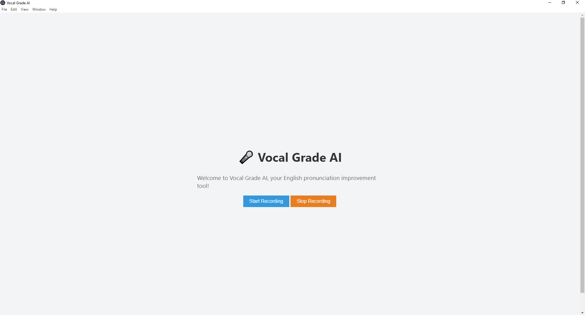
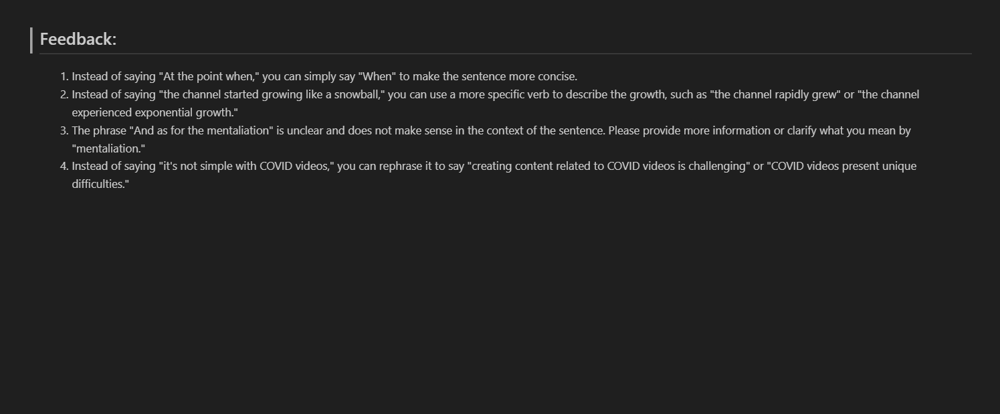

# Vocal AI: Enhance Your English Speaking with Personalized Feedback

## Introduction

Vocal AI is a revolutionary application designed to empower non-native English speakers in improving their spoken English skills. With the integration of advanced speech analysis technology and personalized feedback from experienced English teachers, Vocal AI offers an immersive and convenient way to enhance your English pronunciation and communication.

## Feedback File

## Key Features

- **Seamless Voice Analysis**: Vocal AI enables users to easily record their spoken English using their computers. The application utilizes cutting-edge speech recognition technology to accurately transcribe and analyze the recorded audio.

- **Personalized Feedback**: After analyzing the spoken input, Vocal AI generates a comprehensive PDF report that provides constructive feedback on various aspects of pronunciation, intonation, pacing, and overall speech clarity. This feedback is tailored to each user's specific needs, helping them identify areas for improvement.

- **Experienced English Teachers**: Our platform connects users with experienced English teachers who review the analyzed audio and provide insightful suggestions for enhancement. This human touch ensures that learners receive nuanced feedback that goes beyond automated assessments.

- **Progress Tracking**: Vocal AI allows users to track their progress over time. Through a user-friendly interface, individuals can review previous feedback reports, monitor their improvement, and set goals for their English speaking journey.

## How to Use

1. **Recording Audio**:

   - Launch the Vocal AI application on your computer.
   - Click on the "Record" button and speak a paragraph or a few sentences in English.
   - Click "Stop" when you're done recording.

2. **Generating Feedback**:

   - After recording, the application will process the audio using its advanced speech analysis technology.
   - Once the analysis is complete, you will receive a PDF report via email or within the application itself. This report will contain detailed feedback from English teachers.

3. **Review and Practice**:

   - Open the PDF report to review the feedback provided by the English teachers.
   - Take note of the specific areas that require improvement and the suggestions offered.

4. **Practice and Improvement**:
   - Utilize the feedback to practice your spoken English. Focus on the recommended exercises and strategies provided by the teachers.
   - Record additional audio samples to track your progress over time.
